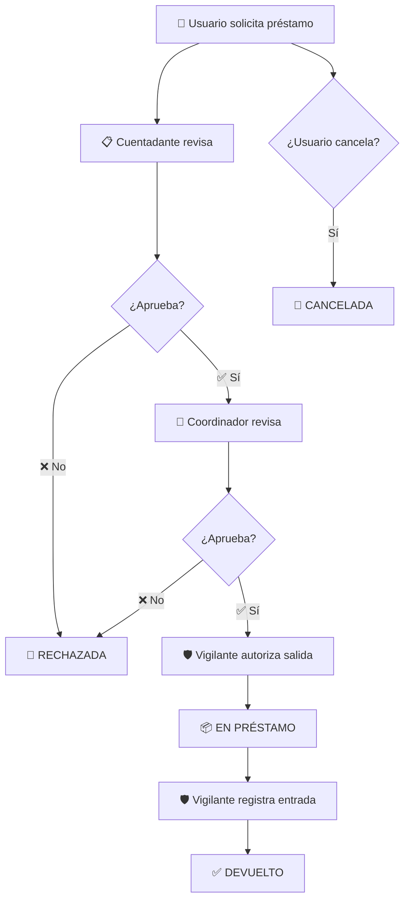

# 🏛️ Sistema de Gestión de Bienes - SENA

Sistema web completo para la gestión y control de préstamos de bienes institucionales del SENA, desarrollado con Next.js 16 y PostgreSQL.


## 📋 Descripción

Sistema web integral desarrollado con Next.js que permite gestionar el inventario de bienes del SENA, controlar préstamos con sistema de firmas optimizado (Cuentadante → Coordinador → Vigilante), autorizar salidas/entradas de bienes con validación por sede, y administrar usuarios con roles específicos. Incluye scripts automatizados para configuración completa y datos de prueba realistas.

## ✨ Características Principales

### 🔐 **Autenticación y Seguridad**
- ✅ **Sistema de autenticación JWT** con bcryptjs para encriptación segura
- ✅ **Middleware de protección** de rutas por rol
- ✅ **Validación por sede** - Coordinadores y vigilantes solo ven solicitudes de su sede asignada
- ✅ **Sesiones persistentes** con renovación automática de tokens

### 👥 **Gestión de Usuarios**
- ✅ **6 roles específicos** con permisos diferenciados
- ✅ **Dashboard personalizado** por rol de usuario
- ✅ **Interfaz moderna de gestión** con tabla avanzada y filtros múltiples
- ✅ **Registro público** con asignación de roles por administrador

### 📦 **Gestión de Inventario**
- ✅ **Registro detallado de bienes** con códigos únicos
- ✅ **Asignación de cuentadantes** por sede y ambiente
- ✅ **Control de estados** (Disponible, En préstamo, En mantenimiento)
- ✅ **Historial completo** de asignaciones y movimientos

### 📝 **Sistema de Solicitudes**
- ✅ **Flujo de firmas optimizado** (Cuentadante → Coordinador → Vigilante)
- ✅ **Estados simplificados** sin redundancias (7 estados principales)
- ✅ **Observaciones obligatorias** en rechazos y cancelaciones
- ✅ **Timestamps precisos** con fecha y hora exacta
- ✅ **Filtros por estado específicos** según el rol del usuario

### 🎨 **Interfaz de Usuario**
- ✅ **Diseño responsive** y moderno con TailwindCSS v4
- ✅ **Paleta de colores SENA** (verde institucional)
- ✅ **Paginación consistente** de 10 elementos en todas las tablas
- ✅ **Hover effects unificados** (`hover:bg-green-50`) en todas las tablas
- ✅ **Filtros avanzados** con búsqueda por texto y selección de estados
- ✅ **Botón "Limpiar filtros"** en todas las tablas con filtros activos
- ✅ **Sidebar con navegación activa** y indicadores visuales
- ✅ **Modales responsivos** con scroll independiente

### 🔧 **Herramientas de Desarrollo**
- ✅ **Scripts automatizados** para configuración completa (4 scripts esenciales)
- ✅ **Datos de prueba realistas** con historial variado
- ✅ **Credenciales secuenciales** para facilitar testing (100001-100021)
- ✅ **Documentación completa** con guías paso a paso

## 🛠️ Tecnologías

### Frontend
- **Next.js 16.0.3** - Framework React con SSR
- **React 19.2.0** - Biblioteca de UI
- **TailwindCSS v4** - Framework CSS utility-first
- **React Select** - Componentes de selección avanzados

### Backend
- **Next.js API Routes** - Endpoints RESTful
- **PostgreSQL** - Base de datos relacional
- **JWT** - Autenticación con tokens
- **bcryptjs** - Encriptación de contraseñas

## 📦 Instalación

### 📋 Prerrequisitos

Antes de instalar, asegúrate de tener:

- **Node.js 18+** - [Descargar aquí](https://nodejs.org/)
- **PostgreSQL 14+** - [Descargar aquí](https://www.postgresql.org/download/)
- **npm** o **pnpm** (recomendado) - [Instalar pnpm](https://pnpm.io/installation)

### 🚀 Instalación Rápida (Recomendada)

**Opción 1: Configuración automática completa**

```bash
# 1. Clona el repositorio
git clone https://github.com/kevin101022/Finalizando_Sena.git
cd Finalizando_Sena

# 2. Instala dependencias
pnpm install

# 3. Configura variables de entorno
cp .env.example .env.local
# Edita .env.local con tus credenciales de PostgreSQL

# 4. Crea la base de datos
createdb sena_bienes

# 5. Importa el esquema
psql -U postgres -d sena_bienes -f database_schema.sql

# 6. Configuración completa automática (RECOMENDADO)
pnpm run setup-complete

# 7. Inicia el servidor
pnpm run dev
```

### 🔧 Instalación Paso a Paso (Detallada)

**1. Clona el repositorio:**
```bash
git clone https://github.com/kevin101022/Finalizando_Sena.git
cd Finalizando_Sena
```

**2. Instala las dependencias:**
```bash
# Con pnpm (recomendado)
pnpm install

# O con npm
npm install
```

**3. Configura las variables de entorno:**

Copia el archivo de ejemplo:
```bash
cp .env.example .env.local
```

Edita `.env.local` con tus credenciales:
```env
# Base de datos PostgreSQL
DB_HOST=localhost
DB_PORT=5432
DB_NAME=sena_bienes
DB_USER=postgres
DB_PASSWORD=tu_contraseña_postgresql

# JWT para autenticación
JWT_SECRET=tu_clave_secreta_jwt_muy_larga_y_segura

# Entorno
NODE_ENV=development
```

**4. Configura PostgreSQL:**

Crea la base de datos:
```sql
-- Conecta a PostgreSQL como superusuario
psql -U postgres

-- Crea la base de datos
CREATE DATABASE sena_bienes;

-- Sal de psql
\q
```

Importa el esquema:
```bash
psql -U postgres -d sena_bienes -f database_schema.sql
```

**5. Configura datos del sistema:**

**Opción A: Configuración automática (RECOMENDADO)**
```bash
# Ejecuta todos los scripts en secuencia
pnpm run setup-complete
```

**Opción B: Configuración manual paso a paso**
```bash
# Paso 1: Resetea la base de datos
pnpm run reset-db

# Paso 2: Crea usuarios, roles y sedes
pnpm run setup-basic

# Paso 3: Crea inventario de prueba (100+ bienes)
pnpm run create-inventory

# Paso 4: Crea solicitudes de prueba con historial realista
pnpm run create-requests
```

**6. Inicia el servidor:**
```bash
# Desarrollo
pnpm run dev

# Producción
pnpm run build
pnpm start
```

**7. Accede al sistema:**
- Abre tu navegador en [http://localhost:3000](http://localhost:3000)
- Usa las credenciales de prueba (ver sección "Credenciales de Prueba")

## 🚀 Scripts Disponibles

### 🔨 Scripts de Desarrollo
```bash
pnpm run dev          # Inicia servidor de desarrollo (http://localhost:3000)
pnpm run build        # Construye la aplicación para producción
pnpm run start        # Inicia servidor de producción
pnpm run lint         # Ejecuta el linter para verificar código
```

### 🗄️ Scripts de Base de Datos (Optimizados)

**Configuración Automática (RECOMENDADO):**
```bash
pnpm run setup-complete   # 🎯 Configuración completa automática
                         # Ejecuta: reset-db + setup-basic + create-inventory + create-requests
```

**Configuración Manual (Paso a Paso):**
```bash
pnpm run reset-db         # 1️⃣ Resetea base de datos y auto-increments
pnpm run setup-basic      # 2️⃣ Crea usuarios, roles, sedes y ambientes
pnpm run create-inventory # 3️⃣ Crea inventario de prueba (105+ bienes)
pnpm run create-requests  # 4️⃣ Crea solicitudes con historial realista
```

### 📊 Resultado de los Scripts

Después de ejecutar `pnpm run setup-complete` tendrás:

- ✅ **21 usuarios de prueba** con credenciales secuenciales (100001-100021)
- ✅ **3 sedes** (Pescadero, Calzado, Comuneros) con 3 ambientes cada una
- ✅ **105+ bienes de inventario** distribuidos equitativamente
- ✅ **30+ solicitudes de prueba** en diferentes estados (historial realista)
- ✅ **4 cuentadantes por sede** para pruebas completas
- ✅ **Sistema completamente funcional** listo para usar

> **⚠️ Importante:** Los scripts deben ejecutarse en orden secuencial (1→2→3→4). El script `setup-complete` hace esto automáticamente.

## 👥 Roles del Sistema

| Rol | Permisos | Funciones Principales |
|-----|----------|----------------------|
| **Administrador** | Gestión completa de usuarios | Asigna roles y sedes (no firma solicitudes) |
| **Almacenista** | Gestión de inventario | Registra y asigna bienes a cuentadantes |
| **Cuentadante** | Gestión de bienes asignados | Aprueba/rechaza solicitudes (1ra firma) |
| **Coordinador** | Aprobación de solicitudes | Aprueba solicitudes (2da firma - definitiva) |
| **Vigilante** | Control de entrada/salida | Autoriza salidas (3ra firma) y entradas (4ta firma) |
| **Usuario** | Solicitud de préstamos | Solicita préstamos de bienes (rol por defecto) |

## 🔐 Credenciales de Prueba

**🔑 Formato de Login:** Usa el **documento como usuario y contraseña**

### 👑 Usuarios Principales por Rol

| Rol | Documento | Contraseña | Sede | Funciones Principales |
|-----|-----------|------------|------|----------------------|
| **👑 Administrador** | `100001` | `100001` | Todas las sedes | Gestión completa de usuarios y sistema |
| **📦 Almacenista** | `100020` | `100020` | Calzado | Gestión de inventario y asignaciones |
| **👤 Usuario Regular** | `100021` | `100021` | Comuneros | Solicitudes de préstamos |

### 🎯 Coordinadores por Sede

| Sede | Documento | Contraseña | Función |
|------|-----------|------------|---------|
| **🏢 Pescadero** | `100014` | `100014` | Aprobación final de solicitudes |
| **🏢 Calzado** | `100015` | `100015` | Aprobación final de solicitudes |
| **🏢 Comuneros** | `100016` | `100016` | Aprobación final de solicitudes |

### 🛡️ Vigilantes por Sede

| Sede | Documento | Contraseña | Función |
|------|-----------|------------|---------|
| **🏢 Pescadero** | `100017` | `100017` | Control de salidas y entradas |
| **🏢 Calzado** | `100018` | `100018` | Control de salidas y entradas |
| **🏢 Comuneros** | `100019` | `100019` | Control de salidas y entradas |

### 📋 Cuentadantes por Sede (4 por sede)

| Sede | Documentos | Contraseña | Función |
|------|------------|------------|---------|
| **🏢 Pescadero** | `100002` - `100005` | Su documento | Primera firma (aprobación inicial) |
| **🏢 Calzado** | `100006` - `100009` | Su documento | Primera firma (aprobación inicial) |
| **🏢 Comuneros** | `100010` - `100013` | Su documento | Primera firma (aprobación inicial) |

### 🔄 Ejemplos de Login

```
Usuario: 100001    Contraseña: 100001    (Administrador)
Usuario: 100016    Contraseña: 100016    (Coordinador Comuneros)
Usuario: 100021    Contraseña: 100021    (Usuario Regular)
```

### 📝 Registro de Nuevos Usuarios

- **URL de registro:** [http://localhost:3000/register](http://localhost:3000/register)
- **Rol por defecto:** Usuario (puede solicitar préstamos)
- **Asignación de roles:** Solo el administrador puede asignar roles específicos y sedes
- **Validación:** Documento único, email único, contraseña mínimo 6 caracteres

> **💡 Tip:** Para probar diferentes flujos, usa coordinadores y vigilantes de la misma sede. Por ejemplo, para Comuneros usa: Usuario `100021` → Cuentadante `100010` → Coordinador `100016` → Vigilante `100019`

## 📊 Flujo del Sistema

### 🔄 Sistema de Firmas Optimizado (4 Etapas)



### 📋 Estados del Sistema

| Estado | Descripción | Siguiente Acción | Responsable |
|--------|-------------|------------------|-------------|
| **🟡 pendiente** | Solicitud creada | Aprobar/Rechazar | Cuentadante |
| **🔵 firmada_cuentadante** | Aprobada por cuentadante | Aprobar/Rechazar | Coordinador |
| **🟢 aprobada** | Aprobada por coordinador | Autorizar salida | Vigilante |
| **📦 en_prestamo** | Bienes entregados | Registrar entrada | Vigilante |
| **✅ devuelto** | Proceso completado | - | - |
| **🚫 rechazada** | Rechazada en cualquier etapa | - | - |
| **❌ cancelada** | Cancelada por usuario | - | - |

### 🏢 Validaciones por Sede

#### Restricciones de Visibilidad
- **🎯 Coordinadores:** Solo ven solicitudes de su sede asignada
- **🛡️ Vigilantes:** Solo ven solicitudes de su sede asignada
- **📋 Cuentadantes:** Solo ven solicitudes de bienes bajo su responsabilidad
- **👑 Administradores:** Ven todo el sistema sin restricciones
- **📦 Almacenistas:** Ven todo el inventario para gestión

#### Flujo por Sede
```
Sede Pescadero: Usuario → Cuentadante (100002-100005) → Coordinador (100014) → Vigilante (100017)
Sede Calzado:   Usuario → Cuentadante (100006-100009) → Coordinador (100015) → Vigilante (100018)
Sede Comuneros: Usuario → Cuentadante (100010-100013) → Coordinador (100016) → Vigilante (100019)
```

### 🔐 Reglas de Negocio

1. **Cancelación:** Solo el usuario puede cancelar antes de la primera firma
2. **Rechazo:** Requiere observación obligatoria del motivo
3. **Sede:** Los bienes solo pueden ser solicitados por usuarios de la misma sede
4. **Cuentadante:** Solo puede firmar solicitudes de bienes asignados a él
5. **Vigilante:** No puede rechazar, solo autoriza salidas y entradas

> **📚 Documentación completa:** Ver `FLUJO_SISTEMA.md` para detalles técnicos adicionales

## 📁 Estructura del Proyecto

```
Finalizando_Sena/
├── app/
│   ├── api/              # API Routes (backend)
│   ├── components/       # Componentes reutilizables
│   ├── dashboard/        # Páginas por rol
│   └── register/         # Registro de usuarios
├── lib/
│   ├── auth.js          # Utilidades de autenticación
│   ├── db.js            # Conexión a PostgreSQL
│   └── solicitudUtils.js # Utilidades de solicitudes
├── scripts/             # Scripts de base de datos
├── database_schema.sql  # Esquema de la base de datos
└── README.md
```

## 🎨 Diseño

### Paleta de Colores SENA
- **Verde Principal**: `#39A900` - Color institucional SENA
- **Verde Secundario**: `#007832` - Complementario
- **Verde Hover**: `#f0fdf4` - Hover effects en tablas
- **Fondos**: Blanco con gradientes verdes en login

### Componentes Destacados
- **Tablas elegantes** con hover verde consistente (`hover:bg-green-50`)
- **Paginación unificada** de 10 elementos en todas las tablas
- **Modales responsivos** con scroll independiente (header y footer fijos)
- **Filtros avanzados** con búsqueda por texto y selector de estados
- **Semáforo de estados** con colores intuitivos (verde suave para "devuelto")
- **Notificaciones Toast** con animaciones suaves
- **Diálogos de confirmación** personalizados
- **Interfaz de gestión de usuarios** con tabla moderna y filtros múltiples

## 🆕 Mejoras y Optimizaciones Implementadas

### ✅ **Sistema de Autenticación y Seguridad**
- **Validación por sede**: Coordinadores y vigilantes solo ven solicitudes de su sede asignada
- **Middleware de protección**: Rutas protegidas por rol con redirección automática
- **Tokens JWT seguros**: Renovación automática y expiración controlada
- **Encriptación bcryptjs**: Contraseñas hasheadas con salt rounds optimizados

### ✅ **Optimización del Flujo de Solicitudes**
- **Sistema de firmas unificado**: Todos los roles usan el mismo endpoint `/api/solicitudes/[id]/firmar`
- **Estados simplificados**: Eliminado estado redundante "autorizada" (7 estados finales)
- **Conteo de firmas corregido**: Incluye rechazos en el conteo (firma = false también cuenta)
- **Timestamps precisos**: Fechas con hora exacta (TIMESTAMP) en lugar de solo fecha (DATE)
- **Observaciones obligatorias**: En rechazos y cancelaciones con validación

### ✅ **Interfaz de Usuario Mejorada**
- **Paginación consistente**: 10 elementos en todas las tablas del sistema
- **Hover effects unificados**: Verde SENA (`hover:bg-green-50`) en todas las tablas
- **Filtros avanzados**: Búsqueda por texto + filtros por estado específicos por rol
- **Botón "Limpiar filtros"**: Aparece cuando hay filtros activos, posicionado a la derecha
- **Sidebar con navegación activa**: Resaltado visual de la pestaña actual con múltiples indicadores
- **Gestión de usuarios moderna**: Interfaz de tabla con filtros múltiples (nombre, email, documento, rol, sede)

### ✅ **Scripts y Datos de Prueba**
- **Scripts optimizados**: Simplificados de 8 a 4 archivos esenciales
- **Configuración automática**: Un solo comando (`npm run setup-complete`) configura todo
- **Datos de prueba realistas**: Historial variado con estados aleatorios (no lineales)
- **Credenciales secuenciales**: Formato simplificado (100001-100021) con documento=contraseña
- **Distribución equitativa**: 4 cuentadantes por sede para pruebas completas

### ✅ **Filtros Específicos por Rol**
- **Vigilante**: Solo estados que maneja (aprobada, en_prestamo, devuelto)
- **Coordinador**: Estados de su flujo (firmada_cuentadante, aprobada, en_prestamo, devuelto, rechazada)
- **Cuentadante**: Todos los estados incluyendo cancelada (para auditoría)
- **Administrador**: Filtro adicional por sede en tabla de solicitudes

### ✅ **Validaciones de Negocio**
- **Vigilante**: Solo autoriza salidas y entradas, no puede rechazar solicitudes
- **Flujo de rechazo**: Proceso termina correctamente cuando alguien rechaza
- **Cancelación con motivo**: Usuario debe proporcionar razón obligatoria al cancelar
- **Alertas personalizadas**: Uso del sistema de confirmación del proyecto (no browser natives)

### 🔧 **Limpieza y Mantenimiento**
- **Endpoints obsoletos eliminados**: Removido `/autorizar-salida` (unificado en `/firmar`)
- **Archivos temporales limpiados**: Sin archivos de prueba o desarrollo
- **Código optimizado**: Eliminación de redundancias y mejora de performance
- **Documentación actualizada**: README y documentación de scripts completamente actualizados

### 📊 **Estadísticas del Sistema Optimizado**
- **21 usuarios de prueba** con roles distribuidos correctamente
- **105+ bienes de inventario** asignados equitativamente
- **30+ solicitudes de prueba** con historial realista en diferentes estados
- **3 sedes completas** con 4 cuentadantes cada una
- **100% funcionalidad** verificada en todos los flujos

## 📚 Documentación Adicional

- **`FLUJO_SISTEMA.md`** - Flujo detallado del sistema de solicitudes
- **`database_schema.sql`** - Esquema completo de la base de datos
- **`DOCUMENTACION_SCRIPTS.md`** - Documentación detallada de los scripts de configuración

## 🚀 Configuración de Producción

### 🔐 Variables de Entorno Requeridas

**Archivo: `.env.local` (Producción)**
```env
# Base de datos PostgreSQL
DB_HOST=tu_host_produccion.com
DB_PORT=5432
DB_NAME=sena_bienes
DB_USER=tu_usuario_produccion
DB_PASSWORD=tu_contraseña_muy_segura

# JWT para autenticación
JWT_SECRET=clave_secreta_jwt_muy_larga_y_segura_minimo_32_caracteres

# Entorno
NODE_ENV=production

# Next.js (opcional)
NEXTAUTH_URL=https://tu-dominio.com
```

### 🏗️ Proceso de Despliegue

**1. Preparación del entorno:**
```bash
# Clona en el servidor
git clone https://github.com/kevin101022/Finalizando_Sena.git
cd Finalizando_Sena

# Instala dependencias de producción
npm ci --only=production
```

**2. Configuración de base de datos:**
```bash
# Crea la base de datos en producción
createdb sena_bienes

# Importa el esquema
psql -U postgres -d sena_bienes -f database_schema.sql

# Configura datos iniciales (SIN datos de prueba)
npm run reset-db
npm run setup-basic
# NO ejecutes create-inventory ni create-requests en producción
```

**3. Build y despliegue:**
```bash
# Build de producción
npm run build

# Inicia el servidor
npm start
```

### 🔒 Consideraciones de Seguridad

**Variables de entorno:**
- ✅ Usa contraseñas fuertes para PostgreSQL (mínimo 16 caracteres)
- ✅ JWT_SECRET debe ser único y de al menos 32 caracteres
- ✅ Nunca commits archivos `.env.local` al repositorio

**Base de datos:**
- ✅ Configura SSL para conexiones PostgreSQL
- ✅ Restringe acceso por IP en PostgreSQL
- ✅ Usa usuario de base de datos con permisos limitados

**Servidor:**
- ✅ Configura HTTPS con certificados SSL
- ✅ Usa un reverse proxy (Nginx/Apache)
- ✅ Configura firewall para puertos específicos

### 🌐 Configuración con Docker (Opcional)

**Dockerfile:**
```dockerfile
FROM node:18-alpine
WORKDIR /app
COPY package*.json ./
RUN npm ci --only=production
COPY . .
RUN npm run build
EXPOSE 3000
CMD ["npm", "start"]
```

**docker-compose.yml:**
```yaml
version: '3.8'
services:
  app:
    build: .
    ports:
      - "3000:3000"
    environment:
      - NODE_ENV=production
    depends_on:
      - postgres
  
  postgres:
    image: postgres:14
    environment:
      POSTGRES_DB: sena_bienes
      POSTGRES_USER: postgres
      POSTGRES_PASSWORD: tu_contraseña
    volumes:
      - postgres_data:/var/lib/postgresql/data
      - ./database_schema.sql:/docker-entrypoint-initdb.d/init.sql

volumes:
  postgres_data:
```

## 🐛 Solución de Problemas Comunes

### 🔌 **Error de Conexión a PostgreSQL**

**Síntomas:**
```
Error: connect ECONNREFUSED 127.0.0.1:5432
Error: password authentication failed for user "postgres"
```

**Soluciones:**
```bash
# 1. Verifica que PostgreSQL esté corriendo
sudo service postgresql status    # Linux
brew services list | grep postgres  # macOS
# Windows: Verifica en Services.msc

# 2. Verifica las credenciales en .env.local
cat .env.local

# 3. Prueba la conexión manualmente
psql -U postgres -d sena_bienes -c "SELECT version();"

# 4. Verifica que la base de datos exista
psql -U postgres -l | grep sena_bienes
```

### 🔐 **Error al Iniciar Sesión**

**Síntomas:**
```
"Credenciales inválidas"
"Usuario no encontrado"
```

**Soluciones:**
```bash
# 1. Verifica que los usuarios estén creados
npm run setup-basic

# 2. Verifica el JWT_SECRET en .env.local
echo $JWT_SECRET  # Debe tener al menos 32 caracteres

# 3. Prueba con credenciales de administrador
Usuario: 100001
Contraseña: 100001

# 4. Verifica en la base de datos
psql -U postgres -d sena_bienes -c "SELECT documento, nombre, rol FROM usuarios LIMIT 5;"
```

### 📦 **Problemas con Dependencias**

**Síntomas:**
```
Module not found
Cannot resolve dependency
```

**Soluciones:**
```bash
# 1. Limpia caché y reinstala
rm -rf node_modules package-lock.json pnpm-lock.yaml
npm install

# 2. Verifica la versión de Node.js
node --version  # Debe ser 18+

# 3. Actualiza npm
npm install -g npm@latest

# 4. Si usas pnpm
pnpm install --frozen-lockfile
```

### 🗄️ **Error en Scripts de Base de Datos**

**Síntomas:**
```
Error: relation "usuarios" does not exist
Error: duplicate key value violates unique constraint
```

**Soluciones:**
```bash
# 1. Resetea completamente la base de datos
npm run reset-db

# 2. Ejecuta la configuración completa
npm run setup-complete

# 3. Si persiste, recrea la base de datos
dropdb sena_bienes
createdb sena_bienes
psql -U postgres -d sena_bienes -f database_schema.sql
npm run setup-complete
```

### 🌐 **Error de Puerto en Uso**

**Síntomas:**
```
Error: listen EADDRINUSE: address already in use :::3000
```

**Soluciones:**
```bash
# 1. Encuentra el proceso usando el puerto
lsof -ti:3000  # macOS/Linux
netstat -ano | findstr :3000  # Windows

# 2. Mata el proceso
kill -9 <PID>  # macOS/Linux
taskkill /PID <PID> /F  # Windows

# 3. O usa otro puerto
PORT=3001 npm run dev
```

### 🔧 **Error de Build en Producción**

**Síntomas:**
```
Error: Build failed
Type errors in production build
```

**Soluciones:**
```bash
# 1. Verifica el linter
npm run lint

# 2. Build en modo desarrollo primero
npm run dev
# Verifica que no hay errores en consola

# 3. Limpia y rebuild
rm -rf .next
npm run build
```

### 📱 **Problemas de Interfaz**

**Síntomas:**
- Tablas no se ven correctamente
- Filtros no funcionan
- Paginación no responde

**Soluciones:**
```bash
# 1. Limpia caché del navegador
Ctrl+Shift+R (Windows/Linux)
Cmd+Shift+R (macOS)

# 2. Verifica la consola del navegador (F12)
# Busca errores de JavaScript

# 3. Verifica que TailwindCSS esté funcionando
# Los estilos deben aplicarse correctamente
```

### 🆘 **Obtener Ayuda**

Si los problemas persisten:

1. **Revisa los logs:**
   ```bash
   # Logs del servidor
   npm run dev
   
   # Logs de PostgreSQL
   tail -f /var/log/postgresql/postgresql-14-main.log
   ```

2. **Verifica la documentación:**
   - `FLUJO_SISTEMA.md` - Flujo del sistema
   - `DOCUMENTACION_SCRIPTS.md` - Scripts detallados
   - `CHANGELOG.md` - Historial de cambios

3. **Contacta al equipo de desarrollo:**
   - Incluye el error completo
   - Especifica tu sistema operativo
   - Menciona los pasos que seguiste

## 🤝 Contribuciones

Las contribuciones son bienvenidas. Por favor:

1. Fork el proyecto
2. Crea una rama para tu feature (`git checkout -b feature/AmazingFeature`)
3. Commit tus cambios (`git commit -m 'Add some AmazingFeature'`)
4. Push a la rama (`git push origin feature/AmazingFeature`)
5. Abre un Pull Request

## 📄 Licencia

Este proyecto fue desarrollado para el **SENA (Servicio Nacional de Aprendizaje)** de Colombia.

## 📞 Soporte y Contacto

### 🆘 **Obtener Ayuda**

Si encuentras problemas o necesitas asistencia:

1. **Revisa la documentación:**
   - `README.md` - Guía completa de instalación y uso
   - `FLUJO_SISTEMA.md` - Flujo detallado del sistema
   - `DOCUMENTACION_SCRIPTS.md` - Scripts de configuración
   - `CHANGELOG.md` - Historial de cambios

2. **Verifica la sección "Solución de Problemas"** en este README

3. **Contacta al equipo de desarrollo** con:
   - Descripción detallada del problema
   - Pasos para reproducir el error
   - Logs o mensajes de error completos
   - Tu sistema operativo y versiones

### 🎓 **Información del Proyecto**

- **Programa:** Análisis y Desarrollo de Software (ADSO)
- **Ficha:** 3115418
- **Institución:** SENA (Servicio Nacional de Aprendizaje)
- **Año:** 2024

### 📋 **Estado del Proyecto**

- ✅ **Completamente funcional** - Todos los módulos implementados
- ✅ **Documentación completa** - Guías de instalación y uso
- ✅ **Scripts automatizados** - Configuración en un solo comando
- ✅ **Datos de prueba** - Sistema listo para demostración
- ✅ **Optimizado y limpio** - Código revisado y optimizado

---

**Desarrollado con ❤️ para el SENA - Gestión eficiente de bienes institucionales**


